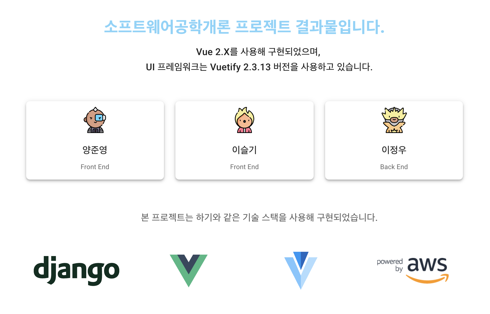

# 2020년 2학기 소프트웨어공학개론 프로젝트

## 실습 관리 웹 어플리케이션 - Your Class

****


## 왜 시작했을까?

### 배경
COVID-19 사태로 비대면 수업이 확장됨에 따라 비대면 학습 도구애 대한
수요가 확장되고 있다. 하지만, 대학교 이외의 중학교 또는 고등학교에서 적절한
학습 프로그램을 확보하지 못해 수업의 질이 낮아지고 있다. 

동국대학교 컴퓨터공학과 `최은만 교수님`의 2020년 2학기 소프트웨어공학개론 강의를
수강하며 학습한 내용 중 `요구 추출, 요구 분석, 설계, 구현, 그리고 테스팅까지의 과정`을
실제로 경험해보기 위하여 시작한 프로젝트이다.

### 진행 과정
9월에서 10월초까지 실제 중학교에서 교사로 재직중이신 두 분의 선배님께 양해를 구하고 
현장에서 필요로 하는 프로그램에 대한 요구 추출과 분석을 진행하였다.

이후 StarUML 도구를 사용해 `유스케이스, 클래스 다이어그램, 시퀀스 다이어그램`의 작성을
진행하였고, 10월 중순 이후 구현작업에 들어갔다.

11월 중순 `테스트 케이스` 작성을 완료하였지만, 실제 테스트 진행을 위한 테스틑 프로그램 작성까지
진행하지는 못하였다. 하지만, 작성한 테스트 케이스를 기반으로 소프트웨어 최종 발표가 진행될 예정이다.

## 함께 한 사람들

> Front End (Vue.js & Vuetify)
>> 양준영
>> 이슬기


> Back End (Django & DRF)
>> 이정우

## 웹사이트 방문해보기
[Your Class](http://ec2-13-124-168-48.ap-northeast-2.compute.amazonaws.com/#/)

# Your-class-Backed

# Include (Apps)
## accounts
```
Student & Instructor models
Views for CRUD user models & profile
```

## subject
```
Class & Enroll models
Views for CRUD Classes & Enroll your student
```

## assignment
```
Assignment & Submit models
Views for CRUD Assignments & Submissions
Upload/Download your Assignments files & Submission Files
```

## post
```
Q&A & Notice models
Views for CRUD Q&As & Notices
```
# Configuration
## Project setup
```
pip3 install django
pip3 install -r requirements.txt
```

## If psycopg2 error occurred
```
pip3 install psycopg2_binary
```

## Add your own SECRET_KEY, DATABASE, HOST, etcs at settings.py

## Migrate your settings
```
python3 manage.py makemigrations
python3 manage.py migrate
```

## Compiles for development
```
python3 manage.py runserver
```

## Edit settings.py for Deploy Productions
```
Edit DEBUG = True to DEBUG=False at settings.py
```

### Customize configuration
See [Django REST framework Reference](https://www.django-rest-framework.org/).

